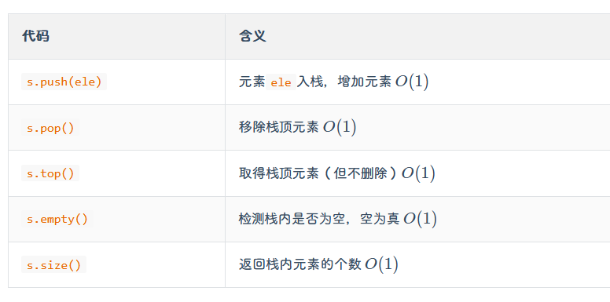
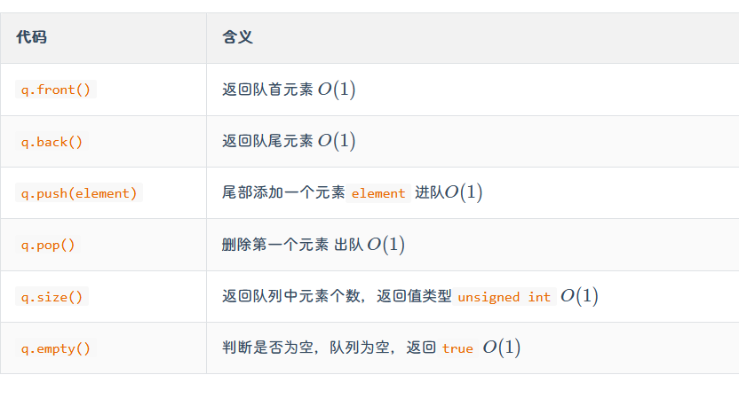
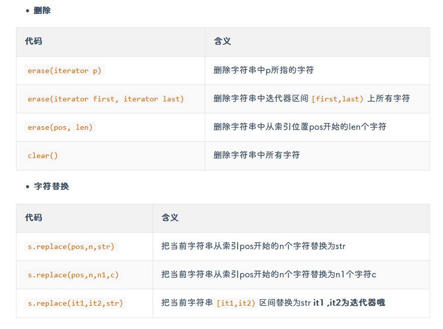
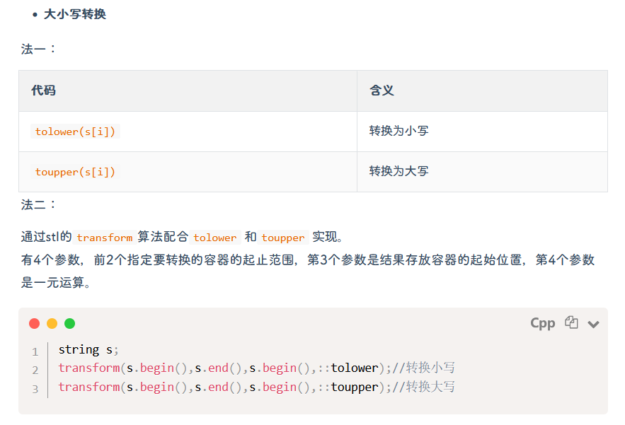
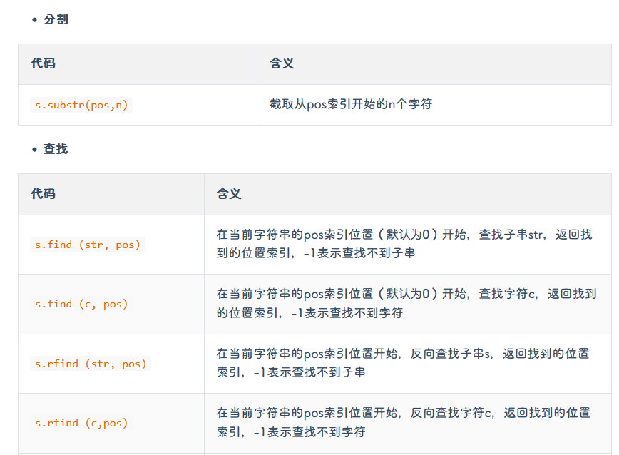

# C++ 常用STL使用
## vector
- `vector`是变长数组，动态数组，在头文件`<vector>`
- `vector`在局部空间(比如局部函数)中，是在堆空间中
- 初始化
```c++
//不限制长度的一维定义
vector<int> a;
vector<double> b;
vector<node> c;//其中node是结构体类型

//定长的一维定义
vector<int> a(n);//定义一个长为n的数组
vector<int> b(n,1);//同上，只不过初始值为1
vector<int> c{1,1,1,2,4};//定义定长，且赋值

//二维初始化
vector<int> v[6];//定义一个6行，不限列的数组

//vector的复制
vector<int> b(a);//拷贝初始化，要求a，b长度一致，数据类型一致
vector<int> c=a;//同上，也是拷贝复制

```
- `vector`常用的方法函数  
  
- `vector`的使用:
- a.同普通数组，采用下标访问`v.pop_back()`
- b.迭代器，通过声明迭代器变量，进行类似指针一样的访问
```c++
vector<int> a(8);
vector<int>::iterator it=a.begin();//声明一个迭代器指向a的初始位置
for(vector<int>::iterator itt=a.begin();itt != a.end();itt++);
```
- c.使用`auto`关键字(智能指针)，在如下实例中，`element`将自动遍历对应容器的每个元素
```c++
for(auto &element : myVector);
```
```c++
#include<bits/stdc++.h>
using namespace std;
int main()
{
	vector<int> a;
	for (int i = 0; i < 100; i++)
	{
		a.push_back(i);
	}
	//sort(a.begin(), a.end(),greater<int>());
	cout << sizeof(int) << endl;//4字节
	cout << sizeof(a) << endl;//长度为32字节
	cout << a.size() << endl;
	
	// for (vector<int>::iterator vi = a.begin(); vi != a.end(); vi++)
	// 	//迭代器是指向容器的指针
	// {
	// 	a.insert(vi, 999);
	// }
    //上述用法是错误实例。会无限插入
	cout << endl;
	//vector<int>::iterator vi = a.begin();
	//a.insert(vi, 9999);
	for (auto &x : a)
	{
		cout << x << " ";
	}
	return 0;
}
```

## stack栈
- 在头文件`<stack>`中，是先进后出，后进先出的数据结构
```c++
stack<int> s;
stack<string> s;
stack<node> s;
```
- 方法函数
- 由于栈只能对栈顶元素进行操作，所以，只能一个一个取出来存入数组

## queue队列
- `#include<queue>`,是先进先出的数据结构
```c++
queue<int> a;
```
- 常用方法函数

## map和set（建议看书）

## string字符串类
- `#include<string>`,字符串类与`char`型字符串类似
```c++
string str1("sss");//定义赋值，长度为3
string str2("sss",8)//长度为8
string str3("1234",0,3)//从第0号位置开始，长度为3，实际上为123
```
- string特性：支持比较运算符，循序按asill码表比较
- 重载了加法运算，多个stirng可以相加（后接前）
```c++
string s;
cin>>s;//读入字符串，遇到空格停止
getchar();//读取前一个输入的换行符，避免对getline造成干扰
getline(cin,s);//读入一行字符串，遇到回车停止
char s1[]=s.c_str();//将字符串转化为字符数组
```
- 常用函数
```c++
string s;
s.size();
s.lenth();//返回字符个数，和上一个一样
s.max_size();//返回string对象最大包含的字符数
s.push_back(element);//末尾插入
s.inseret(pos,element);//在pos处，插入element，后续数据依序后移
s.append(str);//末尾添加str，比加法更好
```


