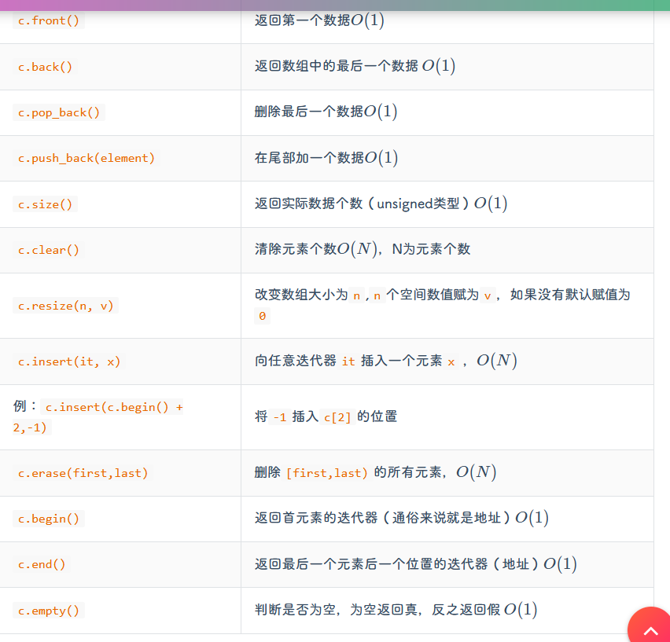

# C++ 常用STL使用
## vector
- `vector`是变长数组，动态数组，在头文件`<vector>`
- `vector`在局部空间(比如局部函数)中，是在堆空间中
- 初始化
```c++
//不限制长度的一维定义
vector<int> a;
vector<double> b;
vector<node> c;//其中node是结构体类型

//定长的一维定义
vector<int> a(n);//定义一个长为n的数组
vector<int> b(n,1);//同上，只不过初始值为1
vector<int> c{1,1,1,2,4};//定义定长，且赋值

//二维初始化
vector<int> v[6];//定义一个6行，不限列的数组

//vector的复制
vector<int> b(a);//拷贝初始化，要求a，b长度一致，数据类型一致
vector<int> c=a;//同上，也是拷贝复制

```
- `vector`常用的方法函数  
  
- `vector`的使用:
- a.同普通数组，采用下标访问`v.pop_back()`
- b.迭代器，通过声明迭代器变量，进行类似指针一样的访问
```c++
vector<int> a(8);
vector<int>::iterator it=a.begin();//声明一个迭代器指向a的初始位置
for(vector<int>::iterator itt=a.begin();itt != a.end();itt++);
```
- c.使用`auto`关键字(智能指针)，在如下实例中，`element`将自动遍历对应容器的每个元素
```c++
for(auto &element : myVector);
```
