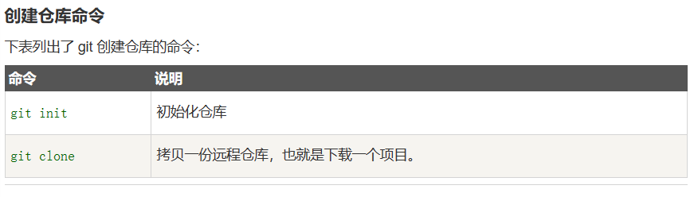

# git学习使用
## 全局及流程
- `/etc/gitconfig` 文件：系统中对所有用户都普遍适用的配置。若使用 git config 时用 --system 选项，读写的就是这个文件
- `~/.gitconfig` 文件：用户目录下的配置文件只适用于该用户。若使用 git config 时用 --global 选项，读写的就是这个文件
- 配置个人名称和电子邮件地址
``` vim
$ git config --global user.name "runoob"
$ git config --global user.email test@runoob.com
```
- `git config --list`查看已用的配置信息
- 
## 基础使用——init,add,commit，clone
- `git init` or `git init direct`将当前/指定目录变成管理仓库  当前目录会多出`.git`的文件，代表git开始跟踪该目录的修改  
- 
- `git add <filename>`将该目录下的对应文件添加到仓库或者说提交到暂存区
- `git commit` or `git commit -m "message content"` 把文件提交到仓库，并添加说明
- `commit`会将暂存区里的所有文件提交到仓库；`add`需要指定文件提交到暂存区
- 
- `git clone <repo> <directory>` 将repo仓库克隆到对应目录，缺省为当前目录
操作汇总
  
  


## 远程仓库
- 远程仓库的设置参考教程
- 目前使用的是https连接，ssl可能出现了一些问题
- 由于访问github通常使用了梯子，所以需要使用`git config --global http.proxy http:127.0.0.1:xxxx`等修改配置
- 将仓库里的文件提交到链接的远程仓库 `git push -u origin main`
- 使用`git fetch` 或者`git merge` 从远程仓库提取最新更新
